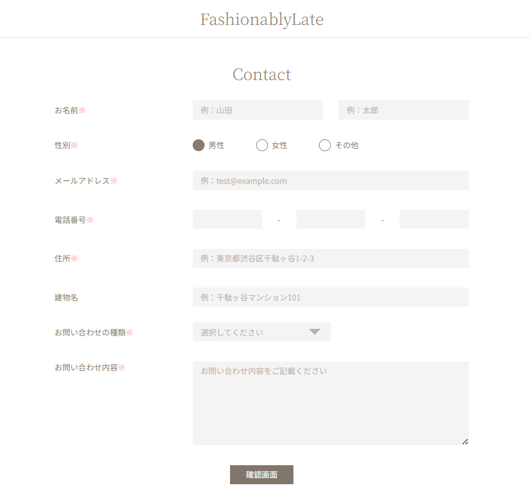

# FashionablyLate(お問い合わせフォーム)

## 環境構築

### Docker ビルド

1. `git clone git@github.com:yoki229/contact-form.git`
2. `cd contactform`
3. DockerDesktop アプリを立ち上げる

### Laravel 環境構築

1. `make init`
   「Command 'make' not found」となる場合は
    - `sudo apt update`
    - `sudo apt install make`
      の後に「make init」してください。
2. `code .`
3. .env ファイルの環境変数を変更

```
DB_CONNECTION=mysql
DB_HOST=mysql
DB_PORT=3306
DB_DATABASE=laravel_db
DB_USERNAME=laravel_user
DB_PASSWORD=laravel_pass
```

4. `docker-compose exec php php artisan migrate --seed`
5. 以上のセットアップで権限のエラーが発生する場合は

```
sudo chmod -R 777 src/*
```

入力、使用してください。

## 使用技術

- PHP 8.2
- Laravel8.83.27
- MySQL 8.0.26

## イメージ図



## URL

- 開発環境：http://localhost/
- phpMyAdmin:：http://localhost:8080/

# coachtech-Checktest-contactform
